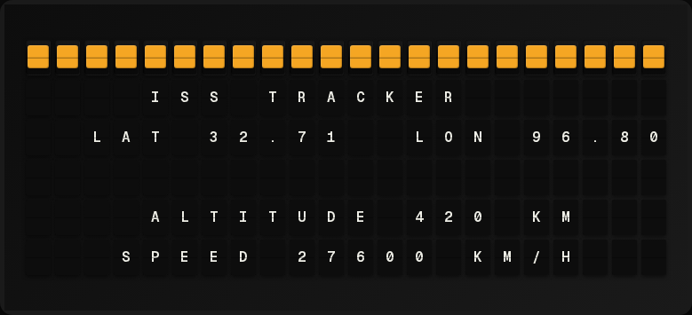

# Generic Data Plugin



Fetch data from any URL (JSON or XML) and map fields to template variables — no custom plugin needed. Supports **multiple feeds** so you can pull data from several APIs at once.

**→ [Setup Guide](./docs/SETUP.md)** - Configuration and setup instructions

## Overview

The Generic Data plugin lets you pull data from any HTTP endpoint and map response fields to template variables using simple dot-notation paths. This is useful for integrating data sources that don't have a dedicated FiestaBoard plugin, such as:

- Public REST APIs (weather stations, transit feeds, IoT sensors)
- Self-hosted services (Home Assistant REST sensors, Node-RED endpoints)
- Static JSON files hosted on a web server
- RSS/Atom feeds served as XML

### Multiple Feeds

Need data from more than one API? Use the **feeds** array to configure multiple data sources in a single plugin. Each feed has its own URL, format, headers, and mappings. All variables end up in the same `generic_data.*` namespace — just make sure variable names are unique across feeds.

## Template Variables

Variables are **dynamic** — you define them in the settings using the "Variable Mappings" section. Each mapping creates a template variable.

For example, if you configure a mapping with variable name `temperature` and path `current.temp_f`, you can use it in templates as:

```
{{generic_data.temperature}}
```

### Built-in Variables

```
{{generic_data.feed_count}}   # Number of configured feeds
```

## Quick Start — Single Feed

1. Enable the plugin in the FiestaBoard settings
2. Enter the URL of your data source
3. Add variable mappings:
   - **Variable Name**: The name you'll use in templates (e.g., `temperature`)
   - **Data Path**: Dot-notation path to the value in the response (e.g., `current.temp_f`)
   - **Default**: Fallback value if the path isn't found (optional)
4. Create a page template using your mapped variables

## Quick Start — Multiple Feeds

1. Enable the plugin
2. In the **Data Feeds** section, add a feed for each API:
   - Set the URL, format, and any authentication headers
   - Add mappings with unique variable names
3. Reference variables from all feeds in your templates

Example with two feeds:

```
{center}DASHBOARD
TEMP: {{generic_data.temperature}}°F
COMMUTE: {{generic_data.commute_time}}
BIKES: {{generic_data.bikes_available}}
```

## Path Syntax

The data path uses dot-notation to navigate the response:

| Path | Matches |
|------|---------|
| `name` | Top-level field |
| `current.temp` | Nested field |
| `items[0].name` | First item in an array |
| `data.results[2].value` | Third result's value |
| `[0]` | First element of a root array |

### JSON Example

Given this response:

```json
{
  "current": {
    "temp_f": 72,
    "condition": { "text": "Sunny" }
  },
  "forecast": [
    { "day": "Monday", "high": 75 },
    { "day": "Tuesday", "high": 68 }
  ]
}
```

| Variable | Path | Result |
|----------|------|--------|
| `temperature` | `current.temp_f` | `72` |
| `condition` | `current.condition.text` | `Sunny` |
| `tomorrow_high` | `forecast[1].high` | `68` |

### XML Example

Given this response:

```xml
<weather>
  <current>
    <temp>72</temp>
    <condition>Sunny</condition>
  </current>
  <location>
    <name>San Francisco</name>
  </location>
</weather>
```

The XML is converted to a nested dict structure, so paths work the same way:

| Variable | Path | Result |
|----------|------|--------|
| `temp` | `current.temp` | `72` |
| `city` | `location.name` | `San Francisco` |

## Example Templates

### Weather Station (single feed)

```
{center}WEATHER STATION
{{generic_data.location}}
TEMP: {{generic_data.temperature}}F
HUMIDITY: {{generic_data.humidity}}%
WIND: {{generic_data.wind_speed}} MPH
```

### Multi-Source Dashboard (multiple feeds)

```
{center}HOME DASHBOARD
TEMP: {{generic_data.temperature}}F
COMMUTE: {{generic_data.commute_time}}
BIKES: {{generic_data.bikes_available}}
AIR: AQI {{generic_data.aqi}}
```

## Configuration

### Single-Feed Mode

| Setting | Type | Default | Description |
|---------|------|---------|-------------|
| enabled | boolean | false | Enable/disable the plugin |
| url | string | *(required)* | URL to fetch data from |
| format | string | "json" | Response format: `json` or `xml` |
| method | string | "GET" | HTTP method: `GET` or `POST` |
| headers | array | [] | Custom HTTP headers (e.g., for authentication) |
| body | string | | Request body for POST requests |
| mappings | array | *(required)* | Variable mappings (see above) |
| refresh_seconds | integer | 300 | How often to fetch new data (minimum 30s) |

### Multi-Feed Mode

| Setting | Type | Default | Description |
|---------|------|---------|-------------|
| enabled | boolean | false | Enable/disable the plugin |
| feeds | array | | Array of feed objects (up to 10) |
| refresh_seconds | integer | 300 | Shared refresh interval (minimum 30s) |

Each feed object:

| Field | Type | Required | Description |
|-------|------|----------|-------------|
| name | string | No | Label for this feed |
| url | string | Yes | URL to fetch data from |
| format | string | No | `json` (default) or `xml` |
| method | string | No | `GET` (default) or `POST` |
| headers | array | No | Custom HTTP headers |
| body | string | No | Request body for POST |
| mappings | array | Yes | Variable mappings |

When `feeds` is set, the top-level `url`/`mappings` fields are ignored.

### Authentication

To use APIs that require authentication, add a custom header:

| Header Name | Header Value |
|-------------|-------------|
| `Authorization` | `Bearer your-token-here` |

Or for API key authentication:

| Header Name | Header Value |
|-------------|-------------|
| `X-API-Key` | `your-api-key` |

## Features

- **Any URL**: Fetch data from any HTTP/HTTPS endpoint
- **Multiple Feeds**: Pull from up to 10 different APIs at once
- **JSON & XML**: Parse both JSON and XML responses
- **Dot-notation Paths**: Simple path syntax to extract values
- **Array Support**: Access items by index (e.g., `items[0].name`)
- **Default Values**: Fallback values when paths don't match
- **Custom Headers**: Add authentication and custom headers per feed
- **POST Support**: Send request bodies for POST endpoints
- **Partial Failure**: If one feed fails, data from the others is still available
- **Size Limit**: Responses limited to 1 MB each for safety
- **No Dependencies**: Uses only the `requests` library (already included)

## Author

FiestaBoard Team
